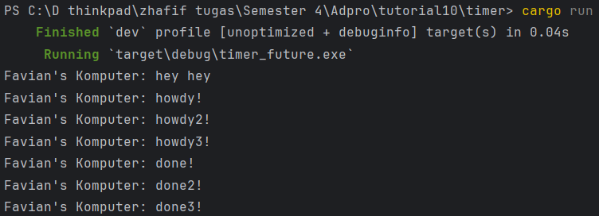
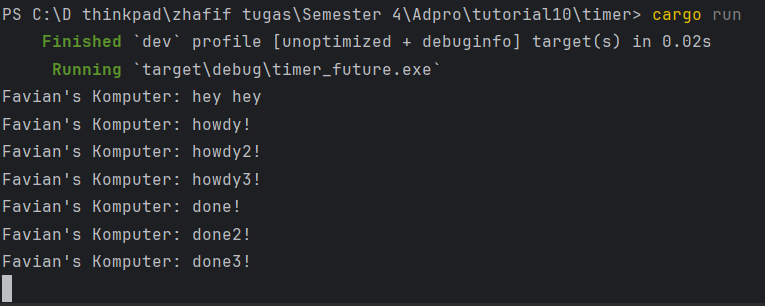

# Module 10 - Tutorial 2


Output pada terminal tersebut terjadi karena cara kerja executor dan future yang diimplementasikan secara manual menggunakan channel dan `ArcWake`.

## 1. `println!("Favian's Komputer: hey hey");`

   Ini dipanggil di `main` langsung sebelum executor dijalankan. Karena tidak async, langsung dicetak duluan.


## 2. Spawner menjalankan task async:

   ```rust
   spawner.spawn(async {
       println!("howdy!");
       TimerFuture::new(Duration::new(2, 0)).await;
       println!("done!");
   });
   ```

   Ketika task ini dieksekusi oleh executor:

   `howdy!` langsung dicetak. Lalu `.await` memanggil `TimerFuture`, yang belum selesai karena `Duration::new(2, 0)` (menunggu 2 detik).  Karena belum selesai, task ini men-self-reschedule lewat `wake_by_ref`.


## 3. Executor mem-poll ulang setelah timer selesai

   Setelah 2 detik, `TimerFuture` selesai, dan executor melanjutkan polling future. `println!("done!")` dijalankan.

`TimerFuture` adalah future kustom yang menggunakan thread untuk "sleep" dan memanggil `wake()` pada `Waker`. Saya membuat executor manual, bukan pakai tokio/async-std.

# Module 10 - Tutorial 3

Dengan `drop(spawner)`:


Tanpa `drop(spawner)`:



Saya membuat executor dan spawner yang mengeksekusi `Future` yang berisi `TimerFuture`. Tiga task async disubmit ke spawner. Di akhir `main`, saya bisa memanggil `drop(spawner)` untuk menutup pipeline pengiriman task.

## Dengan `drop(spawner)`

Ketika saya memanggil `drop(spawner)`, channel `SyncSender` akan tertutup karena semua `clone` dari sender sudah di-drop. `executor.run()` melakukan loop pada `ready_queue.recv()`.  Ketika channel sudah tertutup dan tidak ada lagi task, maka `recv()` akan mengembalikan error dan loop berhenti.  Ini membuat program selesai dengan normal setelah semua task selesai.


## Tanpa `drop(spawner)`

Tanpa `drop(spawner)`, channel masih terbuka, walaupun saya tidak menambahkan task baru.  Maka, `executor.run()` akan terus memanggil `recv()`, menunggu task baru selamanya. Ini disebut deadlock ringan / hang karena channel tidak tertutup dan executor tidak pernah tahu bahwa tugasnya selesai.  Secara teknis program belum selesai, hanya `main()` yang menunggu idle di `recv()`.

`sync_channel` memiliki dua ujung:

* `SyncSender` (dari `Spawner`)
* `Receiver` (dari `Executor`)

Jika saya tidak memanggil `drop(spawner)` (atau tidak semua `clone` di-drop), `Receiver::recv()` tidak akan pernah mengembalikan `Err`, jadi `Executor::run()` tidak akan pernah keluar dari loop.

Kalau saya ingin executor berhenti dengan benar setelah semua task disubmit, `drop(spawner)` wajib ada, karena itu satu-satunya sinyal bahwa tidak akan ada task tambahan.