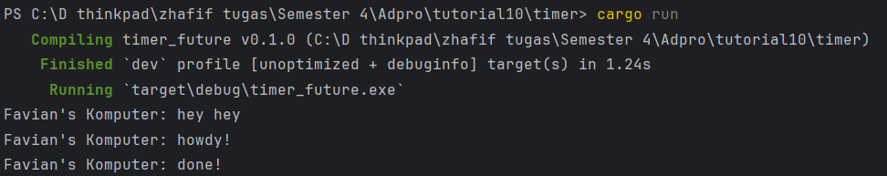

Output pada terminal tersebut terjadi karena cara kerja executor dan future yang diimplementasikan secara manual menggunakan channel dan `ArcWake`.

1. **`println!("Favian's Komputer: hey hey");`**

   Ini dipanggil di `main` langsung sebelum executor dijalankan. Karena tidak async, langsung dicetak duluan.


2. **Spawner menjalankan task async:**

   ```rust
   spawner.spawn(async {
       println!("howdy!");
       TimerFuture::new(Duration::new(2, 0)).await;
       println!("done!");
   });
   ```

   Ketika task ini dieksekusi oleh executor:

   `howdy!` langsung dicetak. Lalu `.await` memanggil `TimerFuture`, yang belum selesai karena `Duration::new(2, 0)` (menunggu 2 detik).  Karena belum selesai, task ini men-self-reschedule lewat `wake_by_ref`.


3. **Executor mem-poll ulang setelah timer selesai**

   Setelah 2 detik, `TimerFuture` selesai, dan executor melanjutkan polling future. `println!("done!")` dijalankan.

`TimerFuture` adalah future kustom yang menggunakan thread untuk "sleep" dan memanggil `wake()` pada `Waker`. Saya membuat executor manual, bukan pakai tokio/async-std.